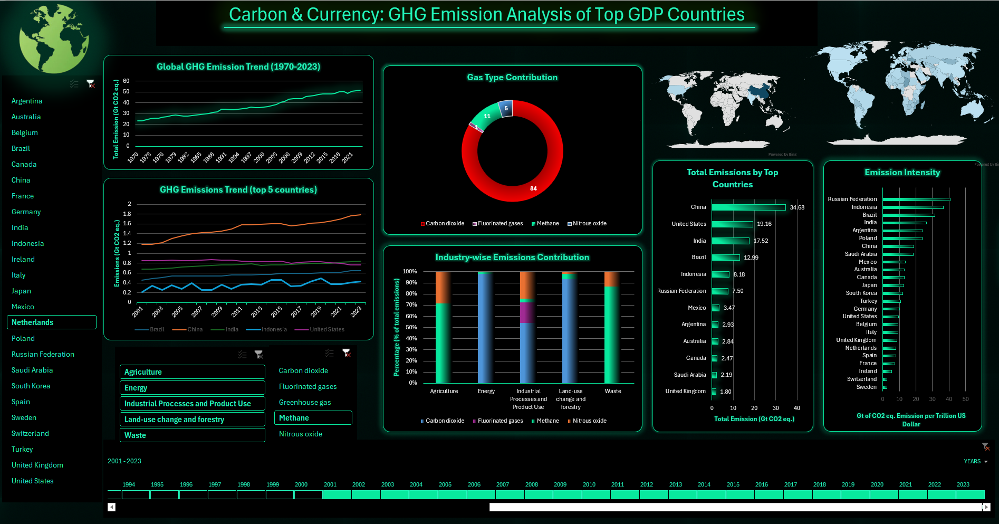

# 🌍 Carbon & Currency: GHG Emission Analysis of Top GDP Countries (1970–2023)

An interactive Excel-based dashboard analyzing greenhouse gas (GHG) emissions data from the world’s top 25 economies (by GDP) between 1970 and 2023. Built entirely using Microsoft Excel, the dashboard leverages PivotTables, slicers, KPI cards, and advanced charting — all presented in a sleek dark theme (black & green).

---

## 📌 Project Objectives

### ✅ Objective 1:
**Analyze the aggregate GHG emissions trajectory** of the world’s 25 largest economies (by GDP) as a single group over the period 1970–2023.  
👉 Understand the **overall emissions trend** among high-output nations and their **collective impact** on global GHG levels.

### ✅ Objective 2:
**Reveal how each country’s annual emissions** evolved from 1970 through 2023.  
👉 Track temporal emission trends — rapid growth (e.g., China), steady increase (e.g., India), or stabilization (e.g., Germany).

### ✅ Objective 3:
**Show the proportional contribution of major economic sectors** (Energy, Agriculture, Land Use, etc.) to each country’s total emissions.  
👉 Identify **dominant polluting sectors** for better-targeted policy action.

### ✅ Objective 4:
**Break down each country’s emissions portfolio by gas** — CO₂, CH₄, N₂O, and F-gases.  
👉 Inform **targeted mitigation strategies** based on gas dominance.

### ✅ Objective 5:
**Assess how efficiently each country converts economic output into emissions** by comparing cumulative GHG emissions (1970–2023) against GDP (2023).  
👉 Classify **high-intensity economies** (e.g., India, Russia) vs **low-intensity economies** (e.g., France, Spain).

---

## 📊 Dashboard Features

- Fully interactive Excel dashboard
- Year-wise, country-wise, gas-wise, sector-wise analysis
- KPI Cards (Top emitter, Total emissions, GDP efficiency)
- Timeline & Slicers for filtering
- Dark theme (Black & Green) for modern, professional design

---

## 📂 Dataset Sources

- [IMF Climate Data Dashboard](https://climatedata.imf.org/datasets/72e94bc71f4441d29710a9bea4d35f1d/explore)  
  ↪ “National Greenhouse Gas Emissions Inventories and NDC Targets”  
- [World Bank GDP (current US$)](https://data.worldbank.org/indicator/NY.GDP.MKTP.CD)  
  ↪ 2023 GDP figures used for Emission Intensity metric

---

## 📸 Dashboard Preview

---

## 👨‍💻 Author

**Abhinav**  
INT217 – Lovely Professional University  
Project: Carbon & Currency Dashboard  
Guide: [Faculty Name]

---

## 🏷️ Tags

`Excel Dashboard` `GHG Emissions` `Climate Change` `Data Visualization` `Carbon Intensity` `GDP Analysis` `Environmental Analytics` `Sustainable Development` `Excel Project` `PivotTables`
